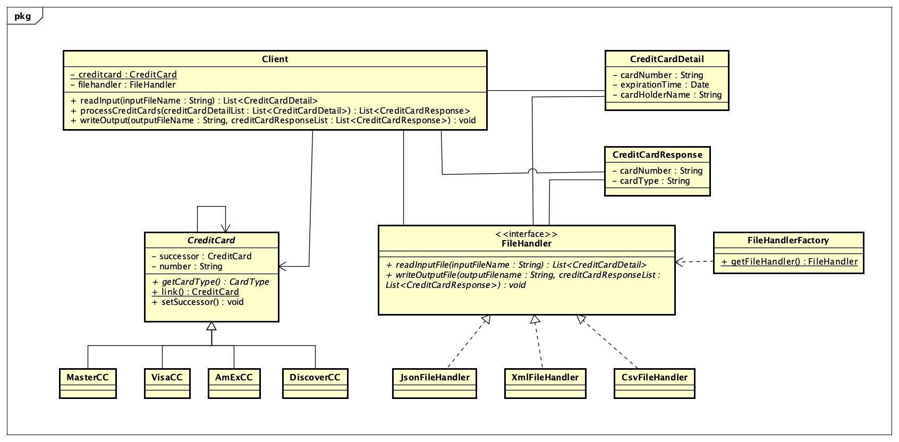

# Credit Card Problem

### Design Patterns
- Chain of Responsibility.
- Factory method.

### Class Diagram


### Documentation
https://github.com/gopinathsjsu/individual-project-cmpe202-01-gannaraputeja/CreditCardApplication.pdf

### Steps to Run application
- Execute below command to build.
```
$ ./gradlew clean build
```
- Execute below command to run.
```
$ ./gradlew bootRun --args="input_file.json output.json"

$ ./gradlew bootRun --args="input_file.xml output.xml"  

$ ./gradlew bootRun --args="input_file-1.csv output.csv"

```


### References
- https://sjsu.instructure.com/courses/1489706/assignments/6384697


